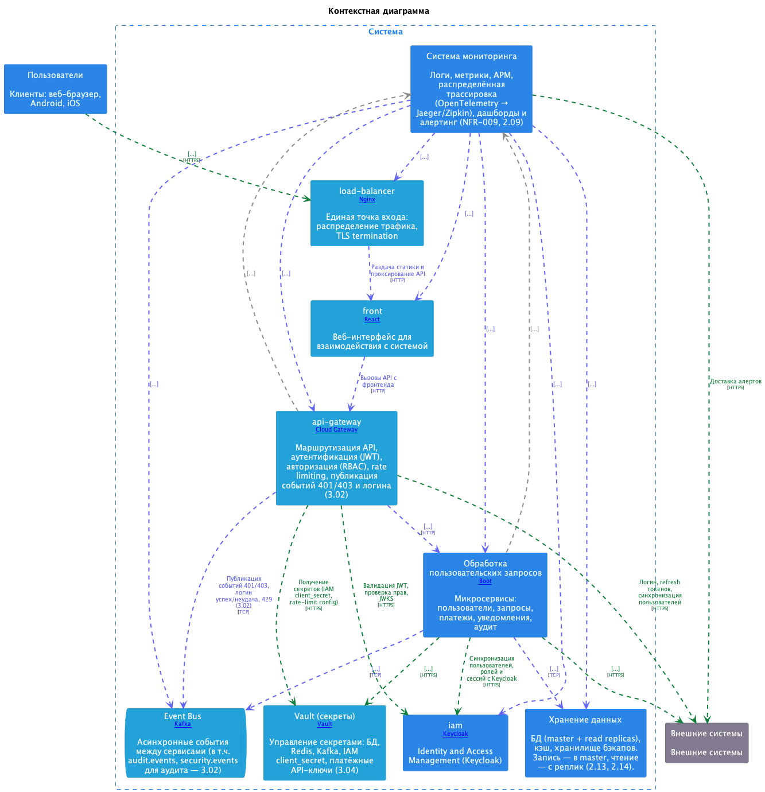

= Architecture as Code на практике: LikeC4 + AsciiDoc для актуальной архитектуры
:doctype: article
:toc:
:toclevels: 2
:sectnums:

Когда-то дом могли построить, имея под рукой топор и дерево рядом с участком. Сегодня строительство устроено иначе - материалов больше, инструментов больше, а еще нужны проекты и схемы разного уровня: отдельно для конструкций, отдельно для отопления, электрики и сантехники.

С ИТ-архитектурой происходит то же самое. Недостаточно только "базового набора" вроде ноутбука, монитора и клавиатуры. Нужны специализированные инструменты - для моделирования, визуализации, фиксации ограничений и совместной работы команды.

Проблема в том, что сами инструменты и подходы быстро меняются. Если архитектура остается только в Confluence и устных договоренностях, она устаревает быстрее, чем код. Через пару спринтов диаграммы уже "не про то", а архитектурные решения не проходят проверку реальностью.

Именно здесь появляется `Architecture as Code` - подход, в котором архитектура живет как инженерный артефакт: версионируется в Git, проверяется в CI/CD и развивается через MR. В этой статье разберем практическую связку `LikeC4` для модели и `AsciiDoc` для документации.

== Кратко

* Архитектура как код - это не про красивые схемы, а про проверяемые ограничения.
* `LikeC4` дает C4-модель как исходники (`.c4`) с диффами, ревью и тестами.
* `AsciiDoc` фиксирует контекст решений, требования и обоснования рядом с моделью.
* Архитектурные изменения ведутся в отдельном репозитории с собственными MR и проверками.

== Почему "архитектура в документах" ломается

Обычный сценарий:

* диаграмма создаются, но как правило не обновляются;
* сервисы и контракты меняются каждую неделю;
* ревью кода проходит без сверки с архитектурными ограничениями.

Итог - "документированная архитектура" живет отдельно от системы.

`Architecture as Code` закрывает этот разрыв:

* артефакты архитектуры хранятся в отдельном архитектурном репозитории;
* ограничения формулируются как правила;
* правила проверяются автоматически в pipeline.

== Что именно кодируем

Практически полезный минимум:

* контекст системы и внешние акторы;
* контейнеры и ключевые компоненты;
* интерфейсы, протоколы, синхронные и асинхронные взаимодействия;
* инфраструктурные ограничения (например, допустимые зависимости и boundary rules);
* ссылки на ADR, OpenAPI, схемы БД и эксплуатационные метрики.

Здесь важно не "оцифровать все", а начать с того, что чаще всего вызывает расхождения между планом и реализацией.

== Роль LikeC4

`LikeC4` - это язык описания C4-модели и набор инструментов вокруг нее.

Что это дает команде:

* диаграммы задаются текстом, а не мышкой;
* изменения видны в `git diff`;
* модель можно тестировать и линтить;
* из модели собирается статический сайт с навигацией по представлениям.

=== Основные возможности LikeC4 (по документации)

Официальная документация: https://likec4.dev/[likec4.dev]

* DSL для описания `specification`, `model`, `views` и deployment-слоя в одном источнике истины;
* views как проекции модели - с разным уровнем детализации, scoped views и расширением (`extends`) без дублирования;
* предикаты для управляемого включения элементов и связей в конкретное представление;
* генерация артефактов "из коробки" - статический сайт, экспорт диаграмм, интеграция в документацию и UI;
* API/MCP-интеграция для доступа к архитектурной модели из внешних инструментов и AI-ассистентов.

=== AI-skills для генерации схем LikeC4

В LikeC4 есть отдельный раздел по AI-инструментам: https://likec4.dev/tooling/ai-tools/[AI Tools].

Практически это дает два уровня автоматизации:

* Agent Skills - подключают для AI-ассистента справочник DSL и снижают риск "галлюцинаций" в синтаксисе;
* MCP Server - дает LLM доступ к текущей архитектурной модели, чтобы строить и уточнять схемы на основе реального контекста проекта.

Базовое подключение skills в проект:

[source,bash]
----
npx skills add https://likec4.dev/
----

=== Пример на базе моего проекта

Публичный пример с визуализацией архитектуры в LikeC4:
https://shelepovg.github.io/system-design-homework[system-design-homework]

Исходный код проекта:
https://github.com/shelepovg/system-design-homework[shelepovg/system-design-homework]

Кратко о проекте:

* это практический стенд `Architecture as Code` с LikeC4-моделью;
* в нем можно посмотреть структуру системы и связи между элементами в формате интерактивных представлений;

Пример описания контейнера и связей:

[source]
----
user-service = container 'User Service' {
    summary 'Профили, сессии, роли (RBAC)'
    technology '[Spring Boot]'
    icon tech:java
    link https://gitlab/user-service 'GitLab'
    link https://confluence/hld 'HLD'
    metadata{
        owner 'user@domain.ru'
    }
}

postgres-master = database 'PostgreSQL (master)' {
    technology '[PostgreSQL]'
    summary 'Точка записи: users_db, requests_db'
    icon tech:postgresql
}

user-service -[tcp]-> postgres-master 'Запись users/sessions/roles' 'TCP, JDBC, PostgreSQL' { #sync }
user-service -[tcp]-> cache 'Cache-Aside для профилей и сессий' 'TCP, Redis RESP' { #sync }
----

Пример представления:

== Роль AsciiDoc рядом с моделью

Графическая модель отвечает на вопрос "что с чем связано".
`AsciiDoc` отвечает на вопросы:

* почему принято такое решение;
* какие допущения и ограничения учтены;
* как проверять качество и соответствие;
* какие есть риски и компромиссы.

Плюс - из одного источника можно получить HTML/PDF для разных потребителей: разработчики, архитектурный комитет, аудит.

== Как это выглядит в репозиториях

Типовая структура для коммерческой эксплуатации:

* `likec4/` - модель, deployment и views;
* `doc/` или `presentations/` - объясняющая документация в AsciiDoc;
* CI job в архитектурном репозитории, который валидирует модель и блокирует merge при нарушениях.

При разделении репозиториев критичен процесс синхронизации:

* общие идентификаторы изменений (issue/ticket/ADR);
* правило "нет merge в production-код без обновленной архитектурной модели".

== CI/CD: где появляется ценность

Минимальный pipeline для старта:

. Сборка представлений модели (например, `npm run build:likec4`).
. Тесты/линтер архитектурной модели (например, `npm run test:likec4`).
. Проверка целостности ссылок на документацию и артефакты.
. Публикация статического отчета как build artifact.

Даже такой базовый набор снижает риск "тихого дрейфа архитектуры", когда код уже ушел в сторону, а архитектурный репозиторий еще не обновлен.

== Фитнес-функции на базе LikeC4

Когда архитектурная модель поддерживается как код и регулярно обновляется, на ее основе можно строить архитектурные фитнес-функции - автоматические проверки соответствия между "как задумано" и "как работает в runtime".

В таком режиме LikeC4-модель может стать мастер-системой хранения архитектурных метаданных - источником, с которым сверяются окружения, конфигурации и реальные взаимодействия компонентов.

Примеры практических фитнес-функций:

* сравнение задеплоенного в Kubernetes с тем, что описано в архитектурной модели;
* сравнение реальных связей компонентов (по данным кластера/сервис-меша/телеметрии) с заявленными связями в модели;
* проверка `values.yaml` Helm-чартов на соответствие архитектурным ограничениям;
* проверка наличия обязательных метаданных (owner, критичность, зависимости, ссылки на ADR/OpenAPI).

Что это дает на практике:

* раннее обнаружение архитектурного дрейфа;
* более безопасные релизы за счет fail-fast проверок в CI/CD;
* прозрачный аудит изменений - от модели до фактического состояния среды.

== Edge cases и риски внедрения

Перед запуском подхода стоит учитывать:

* **Избыточная детализация** - если моделировать каждый класс, команда быстро устанет поддерживать модель.
* **Формальный adoption** - без включения проверок в CI все останется "декларацией намерений".
* **Нет владельца модели** - нужна роль или процесс, который отвечает за целостность архитектурных артефактов.
* **Слабая связь с runtime** - полезно связывать модель с метриками/логами/трейсингом, иначе теряется трассируемость.
* **Рассинхрон двух репозиториев** - без связки MR и единых правил merge архитектура быстро отстает от реализации.

== С чего начать без большого рефакторинга

Рабочий план на 2-3 итерации:

. Выбрать один критичный поток (например, обработку пользовательского запроса).
. Описать для него C4-контекст и контейнеры в `LikeC4`.
. Зафиксировать 3-5 ключевых ограничений (зависимости, контракты, границы).
. Добавить проверки в CI как non-blocking, затем сделать их blocking.
. Вынести обоснование решений и риски в `AsciiDoc` рядом с моделью.

Такой инкрементальный старт безопаснее, чем попытка сразу перевести всю архитектуру в код.

== Вывод

`Architecture as Code` - это про управляемость изменений, а не про документацию ради документации.
Связка `LikeC4 + AsciiDoc` дает практичный баланс:

* модель архитектуры - как проверяемый код;
* решения и контекст - как поддерживаемый текст;
* единый процесс изменений - через PR и CI/CD.

Если в проекте есть боль от "устаревших схем" и "архитектуры на словах" - этот подход обычно окупается уже на первых релизах за счет снижения архитектурного рассинхрона.
