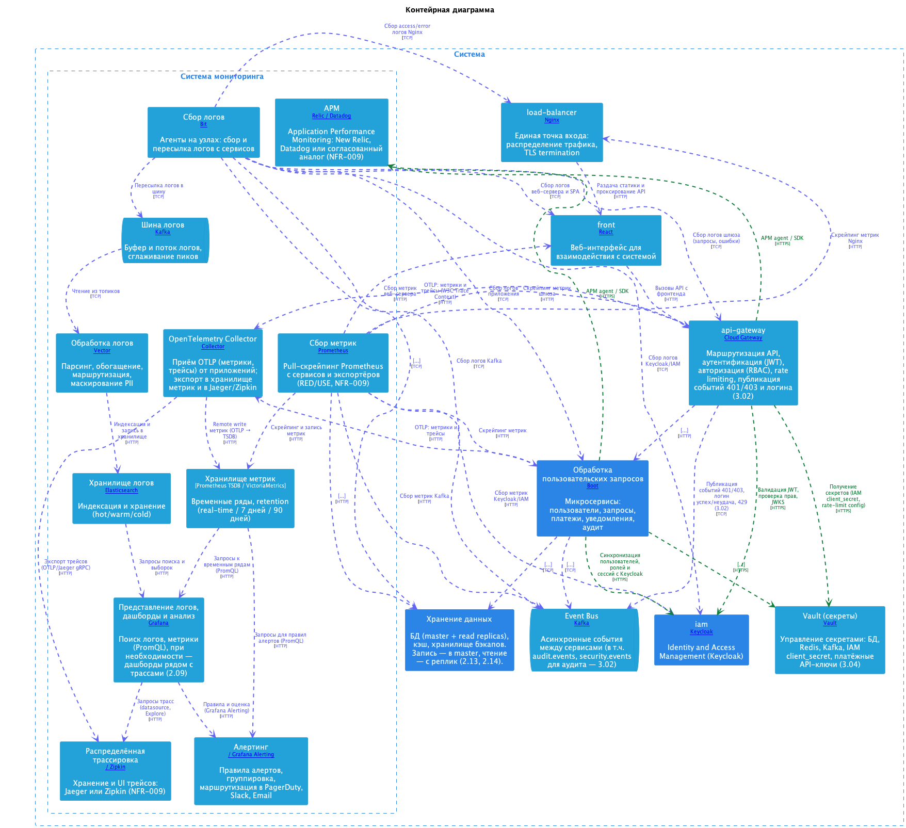

=== Observability

Система мониторинга обеспечивает сбор логов и метрик, их обработку, хранение и представление операторам и разработчикам. Помимо метрик и логов, *NFR-009* («Мониторинг», документ 1.02) требует *APM* (Application Performance Monitoring) и *распределённую трассировку* с использованием OpenTelemetry и визуализации в Jaeger или Zipkin — это отражено в разделе «APM и распределённая трассировка» ниже. Структура стека отражена в контейнерной диаграмме «Система мониторинга (детализация)» в LikeC4.

==== Требования к собираемым метрикам

Метрики делятся на *системные* (инфраструктура и приложение как сервис) и *бизнесовые* (доменные события и результаты). Оба класса обязательны для дашбордов и алертов.

*Системные метрики* (стандартные практики)::
  * *RED (сервисы/endpoint’ы):* Rate (запросов/с), Errors (кол-во и %), Duration (latency p50/p95/p99/p999). По каждому сервису и критичному endpoint.
  * *USE (ресурсы):* Utilization (CPU, memory, disk I/O, network), Saturation (очереди, throttling), Errors (сбои диска, сетевые ошибки). По узлам и контейнерам.
  * *Доступность:* Uptime, health check статусы (liveness/readiness), dependency availability (БД, кэш, IAM, внешние API). Цель алертов — недоступность или деградация.
  * *БД (PostgreSQL):* Активные соединения, пул (usage/max), query latency p95, slow queries, replication lag, IOPS/WAL. Метрики собираются *отдельно по master и по read replicas* (2.13): для master — нагрузка записи и доступность записи; для реплик — lag репликации (критично для RPO=0 при синхронной репликации), нагрузка чтения. Алерт при replication lag > порога (например, > 10 с) — см. 2.10.
  * *Кэш (Redis):* Hit rate, miss rate, latency p95, memory usage, evictions, cluster nodes health. Целевой hit rate > 80% (2.13, 2.07); при необходимости — разбивка по типам ключей (профиль, сессия, результат запроса, rate limit) для диагностики Cache-Aside.
  * *Очереди (Kafka):* Throughput produce/consume, consumer lag по топику/партиции, retention size. Для шины логов и event bus.
  * *Сеть:* Bandwidth in/out, connection count, TLS handshakes, ошибки соединений (по компонентам и зонам).
  * *Бэкапы (связь с 2.13, 2.10):* Время последнего успешного полного бэкапа по каждой БД; успешность и задержка отправки WAL в хранилище бэкапов (при наличии); алерт при пропуске или сбое бэкапа за заданный интервал (например, полный бэкап не выполнялся > 12 ч).

*Бизнесовые метрики* (по домену системы)::
  * *Запросы пользователей:* Количество по типам (PROCESS_DATA, GENERATE_REPORT, EXPORT_DATA, MANAGE_RESOURCES), по статусам (PENDING, PROCESSING, COMPLETED, FAILED, CANCELLED), по приоритету; throughput (RPS) по типам; среднее время обработки (processing_time_ms); размер очереди запросов.
  * *Пользователи и сессии:* Активные пользователи (DAU/MAU при агрегации), одновременные сессии, логины/логауты в единицу времени, отказы аутентификации (по причине). Детализация метрик и алертов по аутентификации, авторизации (401/403) и аномальному поведению — в 3.02 «Аудит безопасности».
  * *Платежи:* Количество транзакций (создано/успешно/неуспешно/возврат), объём (сумма) по периодам, задержка обработки платежа, ошибки интеграции с платёжной системой.
  * *Уведомления:* Отправлено по каналам (Email, SMS, Push, In-app), доставлено/ошибки доставки, задержка от события до отправки, очередь неотправленных.
  * *Ресурсы пользователей:* Количество ресурсов (файлы, конфигурации), объём хранилища (по пользователю/всего), лимиты (10 ГБ, 1000 ресурсов) — приближение к лимиту.
  * *Отчёты:* Создано отчётов по типам, время генерации, успех/ошибка, скачивания.

*Алерты:* На системных — недоступность, latency p95 > 100 ms (критично > 200 ms), error rate > 0,1% (критично > 1%), использование ресурсов > 80% (критично > 90%), cache hit rate < 80% (2.13), consumer lag выше порога, *replication lag БД выше порога* (угроза RPO=0 — 2.13, 2.10), *сбой или задержка бэкапов* (последний успешный полный бэкап / WAL-архив; связь с 2.13, 2.10). На бизнесовых — резкое падение успешных операций, рост очереди запросов, сбой потока платежей или уведомлений.

*Метрики по API и нагрузке (связь с 2.07, 2.11, OpenAPI):*
  * *RPS:* входящие запросы к API Gateway (по маршруту/endpoint) — соответствуют «бизнес-событиям» от клиентов; при необходимости — отдельный учёт внутренних технических вызовов (Backend → БД, кэш, внешние API) для анализа узких мест и сопоставления с множителем 1 запрос → N технических (см. 2.07).
  * *Разбивка по маршрутам:* RED по путям API Gateway (/api/v1/users, /api/v1/requests, /api/v1/payments, /api/v1/notifications) и при необходимости по operationId из OpenAPI (openapi/api-gateway.yaml) для детальных дашбордов и алертов по критичным операциям.

*Метрики устойчивости (Rate Limiter, Retry, Circuit Breaker)* — связь с размещением в 2.08, использование в алертах и реагировании — 2.10::
  * *Rate Limiter:* количество ответов 429 (Too Many Requests) в единицу времени; топ по user_id и по IP; счётчики срабатываний лимита по endpoint; целевая видимость — дашборд «API Gateway / защита» и алерт при аномальном росте 429 или при подозрении на brute-force (логин).
  * *Retry:* количество повторных попыток вызова (по направлению: Gateway→Backend, Gateway→IAM, Backend→внешняя система); успешность после 1-й, 2-й, 3-й попытки; таймауты и отказы после исчерпания попыток — для диагностики нестабильных зависимостей и настройки порогов.
  * *Circuit Breaker:* для каждого экземпляра CB (Gateway→IAM внутр./внеш., Gateway→Backend по маршруту, Payment→платёжный провайдер, Notification→провайдер уведомлений, User Service→IAM): состояние (open / half-open / closed), счётчик отказов при открытии, количество вызовов в состоянии open (быстрый отказ). Алерты: переход в open (2.10 — «Circuit breaker открыт», runbook по платежам/уведомлениям/IAM).

==== APM и распределённая трассировка (NFR-009)

Требования *NFR-009* дополняют метрики RED/USE и логи инструментами уровня приложения и сквозной видимостью запроса по микросервисам.

*APM (Application Performance Monitoring)*::
  * *Инструменты (как в NFR-009):* *New Relic*, *Datadog* или функциональный аналог (единый SaaS-APM либо связка self-hosted: метрики/логи из текущего стека + отдельное профилирование, если политика организации не допускает SaaS).
  * *Назначение:* детальный разбор производительности запросов и фоновых задач (время на сегментах внутри процесса), профилирование (CPU, аллокации — по возможностям выбранного продукта), выявление узких мест (*bottlenecks*) в коде и при обращениях к БД/кэшу/внешним API.
  * *Связь с остальным стеком:* APM не заменяет Prometheus/Grafana; дашборды RED по сервисам остаются источником алертов и SLO. APM используется для углублённой диагностики инцидентов и планирования оптимизаций (см. 2.10).
  * *Внедрение:* агенты или SDK поставщика APM в рантайме сервисов (API Gateway, User Service, Request Processing, Payment, Notification, Audit и др. по приоритету); исключение дублирования чувствительных данных — согласование с 3.03 (маскирование, сэмплирование).

*Распределённая трассировка (Distributed Tracing)*::
  * *Стандартизация:* *OpenTelemetry* (OTel) — единый API/SDK для трассировки (и опционально метрик/логов) в сервисах; экспорт спанов по *OTLP*.
  * *Визуализация и хранение (как в NFR-009):* *Jaeger* или *Zipkin* как бэкенд приёма и UI для просмотра трейсов; допустим эквивалент с поддержкой OTLP (например, Grafana Tempo в связке с Grafana), если команда стандартизует один вендор для метрик, логов и трасс.
  * *OpenTelemetry Collector:* приём OTLP (traces) от приложений, обработка (batch, tail-sampling при высокой нагрузке), экспорт в Jaeger/Zipkin и при необходимости параллельно в долговременное хранилище.
  * *Сквозная корреляция:* заголовки *W3C Trace Context* (`traceparent`, `tracestate`) и передача контекста между API Gateway, внутренними HTTP/gRPC-вызовами, производителями/потребителями Kafka (при поддержке библиотек) — чтобы один пользовательский запрос отображался цепочкой спанов по микросервисам (NFR-009: трейсинг через все микросервисы).
  * *Correlation ID:* `trace_id` (и при необходимости `span_id`) прокидываются в структурированные логи наряду с `request_id` (раздел «Логи» ниже, обогащение в Vector) — поиск в Elasticsearch/Loki по идентификатору трейса связывает логи со спанами в Jaeger/Zipkin.
  * *Покрытие:* обязательно — входящие запросы через API Gateway и синхронные цепочки к доменным сервисам; по мере внедрения — асинхронные обработчики (очереди), вызовы IAM и внешних API (с учётом объёма и политики сэмплирования).

==== Логи: сбор, обработка (Kafka), хранение, представление

*Цепочка:* сбор → шина (Kafka) → обработка → хранилище → представление.

*Сбор логов*::
  * *Fluent Bit* — легковесный агент, низкое потребление ресурсов, встраивается в узлы/под’ы.
  * *Вариант:* единый агент на узле (Fluent Bit) с выводом в Kafka для единообразия и сглаживания пиков.

*Шина логов (Kafka)*::
  * Буфер и поток логов между сбором и обработкой.
  * Сглаживание пиков нагрузки, возможность нескольких потребителей (обработка, архив, аудит).
  * Топики по типу/источнику (app, audit, security) при необходимости; события безопасности и аудита — см. 3.02 (какие события публикуются в audit.events / security.events и как потребляются Audit Service).

*Обработка логов*::
  * *Vector* — парсинг, обогащение (метаданные, request_id; при наличии в событии — trace_id / span_id для связки с Jaeger/Zipkin, см. NFR-009 и раздел «APM и распределённая трассировка»), маршрутизация, маскирование PII, вывод в хранилище.
  * *Маскирование в логах:* перечень полей и категорий данных, подлежащих маскированию или исключению из логов (пароли, токены, платёжные реквизиты, PII), определён в документе 3.03 (раздел «Перечень данных для field-level шифрования и маскирования в логах»). Правила маскирования применяются на этапе обработки (Vector или аналог) и в коде приложения (не передавать чувствительные поля в структурированные логи); соответствие FR-004 и NFR-005.
  * *Вариант:* Vector для снижения нагрузки и единого формата.

*Хранение логов*::
  * *Elasticsearch* — полнотекстовый поиск, гибкие запросы, hot/warm/cold по индексам.

*Представление логов*::
  * *Grafana (Loki)* — запросы к Loki, единый интерфейс с метриками.
  * *Вариант:* Grafana для единой точки входа (логи + метрики).

==== Метрики: сбор, хранение, анализ, представление

*Сбор метрик*::
  * *Prometheus* — скрейпинг по HTTP, Pull-модель, PromQL.
  * *OpenTelemetry Collector* — приём Push (StatsD, OTLP для метрик), нормализация и экспорт в Prometheus/другие бэкенды; тот же Collector (отдельный pipeline или receiver) принимает *OTLP traces* и пересылает их в *Jaeger* или *Zipkin* (NFR-009), см. раздел «APM и распределённая трассировка».
  * *Вариант:* Prometheus как основа; OTel Collector при разнородных источниках, едином OTLP и маршрутизации метрик и трейсов.

*Хранение метрик*::
  * *Prometheus TSDB* — встроенное хранилище, retention до ~15–30 дней без доп. настроек.
  * *VictoriaMetrics* — совместимость с PromQL, меньше ресурсов, длительный retention.
  * *Вариант:* Prometheus TSDB для MVP; VictoriaMetrics для продления retention (7–90 дней по NFR) без усложнения стека.

*Анализ*::
  * Запросы PromQL, запись правил (recording rules) для тяжёлых запросов.
  * Правила алертов в Prometheus/Alertmanager или в Grafana Alerting.

*Представление и алертинг*::
  * *Grafana* — дашборды по слоям (операторы, бизнес, разработка), источники данных: Prometheus/VictoriaMetrics.
  * *Alertmanager* — группировка, дедупликация, маршрутизация уведомлений (PagerDuty, Slack, Email).
  * *Grafana Alerting* — альтернатива при желании держать правила алертов рядом с дашбордами.

Рекомендация для проекта: единый стек с *Kafka* в качестве шины логов, *Vector* для обработки, *Elasticsearch* для хранения логов и *Grafana* для логов и метрик; *Prometheus* для сбора и краткосрочного хранения метрик, при росте объёма — *VictoriaMetrics*; алертинг — *Alertmanager* или *Grafana Alerting*. Для соответствия *NFR-009*: выбрать *APM* (*New Relic*, *Datadog* или согласованный аналог) и внедрить *OpenTelemetry* + бэкенд трассировки *Jaeger* или *Zipkin* (через OTLP и OpenTelemetry Collector), с прокидыванием trace_id в логи.
