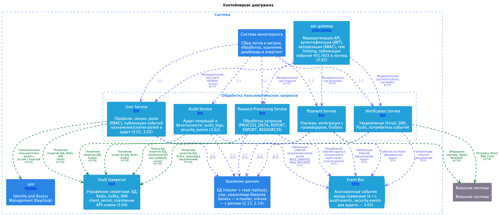

=== Схема взаимодействия

Описание протоколов и способов взаимодействия между компонентами решения. Детализация форматов — в документе 2.12. Типы взаимодействия: *sync* — синхронный запрос-ответ, *async* — асинхронный (очередь/события, ответ не блокирует вызывающего).

==== Взаимодействие: клиенты → Load Balancer → Frontend / API Gateway

*Клиенты → Load Balancer → Frontend / API Gateway:*
  * Протокол: HTTPS (TLS 1.3), HTTP/1.1 и HTTP/2; мобильные клиенты дополнительно WebSocket (уведомления в реальном времени).
  * Формат: REST API (JSON), статика — HTML/CSS/JS.
  * Порт: 443 (HTTPS), 80 — редирект на 443.

==== Настройки TLS на edge (HSTS, PFS) и граница доверенной сети

*Настройки на Load Balancer / edge (обязательные для соответствия NFR-005 и 3.03):*

  * *Версия протокола:* только TLS 1.2 и TLS 1.3; TLS 1.0/1.1 отключены (например, Nginx: `ssl_protocols TLSv1.2 TLSv1.3;`).
  * *Perfect Forward Secrecy (PFS):* только наборы шифров с ephemeral key exchange (ECDHE или DHE). Для TLS 1.3 — стандартные наборы (TLS_AES_256_GCM_SHA384, TLS_CHACHA20_POLY1305_SHA256, TLS_AES_128_GCM_SHA256). Для TLS 1.2 — например ECDHE-RSA-AES256-GCM-SHA384, ECDHE-RSA-CHACHA20-POLY1305; статический RSA key exchange отключён.
  * *HSTS (HTTP Strict Transport Security):* заголовок на всех ответах edge (LB/Front): `Strict-Transport-Security: max-age=31536000; includeSubDomains; preload`. Редирект 80 → 443 сохраняется для первого захода; после ответа с HSTS браузер использует только HTTPS.
  * *Сертификаты:* доверенный CA, срок жизни не более 13 месяцев, автоматическое продление (ACME или корпоративный PKI).

*Граница доверенной сети (внутренний трафик):*

  * *Доверенный периметр:* сегмент «Load Balancer → Frontend, API Gateway → Backend (микросервисы), микросервисы → PostgreSQL, Redis, Kafka» считается *доверенной сетью* при выполнении условий: изоляция сети (segmentación), контроль доступа (security groups / firewall deny-by-default), отсутствие доступа из ненадёжных сетей к этому сегменту. В этом случае требование NFR-005 «TLS 1.3 для всех сетевых соединений» трактуется как применение TLS ко всем соединениям *из ненадёжных сетей* (клиент–LB, API Gateway–IAM, Backend–внешние системы).
  * *Внутри периметра:* протокол HTTP/1.1 или HTTP/2 без TLS допускается; при ужесточении политики (платежи, персональные данные) — включение TLS 1.3 или mTLS на внутренних каналах по отдельному решению.

*API Gateway → Backend (микросервисы):*
  * Маршрутизация по пути и заголовкам (например, /api/users → User Service, /api/requests → Request Processing Service, /api/payments → Payment Service).
  * Протокол: HTTP/1.1 или HTTP/2 (внутренняя сеть в доверенном периметре); TLS внутри периметра — см. «Граница доверенной сети» выше.
  * Формат: JSON (REST), заголовки: X-User-Id, X-Request-Id, X-Trace-Id (сквозная трассировка).
  * Тип: синхронный запрос-ответ; таймаут и retry настраиваются на уровне Gateway и клиента.

*API Gateway → IAM (внутренний Keycloak):*
  * Протокол: HTTPS, OAuth 2.0 / OpenID Connect.
  * Взаимодействие: валидация JWT (introspection или локальная проверка подписи с кэшем JWKS), обмен токенами при логине/refresh.
  * Формат: JWT (access/refresh), JWKS (JSON).

*API Gateway → IAM внешний:*
  * Протокол: HTTPS, OAuth 2.0, OpenID Connect.
  * Синхронные вызовы при логине и при необходимости проверки токена; кэширование результата для снижения нагрузки.

==== Схема потока запроса (sync / async)

Ниже — упрощённая схема одного из типичных потоков: клиентский запрос проходит через Load Balancer и API Gateway к одному из микросервисов; внутри сервиса используются синхронные вызовы к БД и кэшу и при необходимости асинхронная публикация в Event Bus. Пометки *sync* и *async* соответствуют тегам в модели LikeC4 и столбцу «Тип» в сводной таблице.

[source,text]
----
Client (Web / Android / iOS)
   │
   ├──sync──► Load Balancer
   │              │
   │              ├──sync──► Frontend (статическая раздача SPA)
   │              │
   │              └──sync──► API Gateway
   │                             │
   │                             ├──sync──► IAM (валидация JWT, JWKS)
   │                             │
   │                             ├──sync──► IAM внешний (логин, refresh токенов)
   │                             │
   │                             ├──sync──► User Service
   │                             │              ├──sync──► PostgreSQL: users, sessions, roles
   │                             │              ├──sync──► Redis: профили, сессии (Cache-Aside)
   │                             │              └──sync──► IAM: синхронизация пользователей/сессий
   │                             │
   │                             ├──sync──► Request Processing Service
   │                             │              ├──sync──► PostgreSQL: запросы, история
   │                             │              ├──sync──► Redis: кэш результатов
   │                             │              └──async──► Event Bus (Kafka): события для уведомлений и аудита
   │                             │
   │                             ├──sync──► Payment Service
   │                             │              ├──sync──► PostgreSQL: транзакции, outbox
   │                             │              ├──async──► Event Bus: события платежей
   │                             │              └──sync──► Платёжная система (внешняя): инициация платежа
   │                             │
   │                             └──sync──► Notification Service (настройки, управление)
   │                                            ├──sync──► PostgreSQL: статусы доставки
   │                                            ├──async──► Event Bus: потребление событий уведомлений
   │                                            └──async──► Внешняя система уведомлений: Email / SMS / Push
   │
   ◄── Response (синхронный ответ по выбранному пути; async-ветви не блокируют latency ответа)
----

*Примечание.* Audit Service не вызывается напрямую из API Gateway: он получает события *асинхронно* из Event Bus (публикация из Request Processing Service, Payment Service и др.).

==== Взаимодействие между микросервисами (Backend)

*Синхронное (запрос-ответ):*
  * User Service, Request Processing Service, Payment Service, Notification Service (REST API для вызовов от Gateway и при необходимости сервис-сервис): HTTP/1.1 или HTTP/2, JSON.
  * При необходимости низкой задержки между сервисами: gRPC (Protocol Buffers) по отдельным договорённостям; по умолчанию — REST поверх HTTP.

*Синхронное обращение к данным:*
  * Все микросервисы → PostgreSQL (своя БД по паттерну Database per Service): протокол TCP, JDBC; формат — SQL, передача данных по драйверу.
  * Микросервисы → Redis (кэш): протокол TCP, Redis Protocol (RESP); операции GET/SET/INVALIDATE по ключам (Cache-Aside, Write-Through где задано).

*Асинхронное (события):*
  * Payment Service, Request Processing Service, др. → Event Bus (Kafka): протокол Kafka Protocol (TCP); публикация в топики (например, payment.events, notification.requests, audit.events).
  * Notification Service, Audit Service и др. ← Event Bus: потребление из топиков (consumer groups); доставка at-least-once, идемпотентная обработка на стороне потребителя.
  * Формат сообщений: JSON или Avro/Protobuf для схемы (см. 2.12).

==== Взаимодействие с внешними системами

*Backend → Платёжная система:*
  * Синхронно: REST API (HTTPS), JSON; инициация платежа, получение статуса по idempotency key.
  * Асинхронно: приём webhook (HTTPS, входящий вызов от провайдера), JSON body; проверка подписи/секрета.

*Backend → Система уведомлений:*
  * Синхронно или асинхронно: REST API (HTTPS), JSON; отправка шаблонов.
  * Email: SMTP или API провайдера (HTTPS).

==== Схемы взаимодействия (OpenAPI / Swagger)

Описание ключевых API в формате OpenAPI 3.0 (Swagger) — единая точка входа API Gateway и маршрутизация к микросервисам. Спецификация содержит характерные endpoint'ы и схемы данных, связанные с общей моделью данных (документ 2.06).

*Расположение и использование:*
  * Файл: `openapi/api-gateway.yaml`.
  * Пути: `/api/v1/users`, `/api/v1/requests`, `/api/v1/payments`, `/api/v1/notifications` — соответствуют маршрутам Gateway → User Service, Request Processing Service, Payment Service, Notification Service.
  * Схемы (components/schemas) ссылаются на сущности модели данных: `user_id` (users.user_id), `request_id` (user_requests.request_id), `transaction_id` (payment_transactions.transaction_id), `notification_id` (notifications.notification_id).
  * Все описанные вызовы — *синхронные* (sync): запрос от клиента → ответ по тому же соединению. Асинхронные потоки (Event Bus, webhook) в OpenAPI не описываются; они заданы в документе 2.12 и на схеме потока выше.

*Ключевые операции по сервисам:*
  * *User Service:* GET/PATCH `/users/me` (профиль), GET `/users/me/sessions` (сессии).
  * *Request Processing Service:* GET/POST `/requests`, GET `/requests/{request_id}`.
  * *Payment Service:* POST `/payments/transactions` (инициация платежа), GET `/payments/transactions/{transaction_id}`.
  * *Notification Service:* GET `/notifications`, GET/PATCH `/notifications/preferences`.

Полная проработка всех операций и кодов ошибок не требуется для архитектурного описания; при необходимости спецификацию расширяют в рамках разработки.

==== Сводная таблица: протоколы и типы взаимодействия

[options="header",cols="2,2,2,2"]
|===
| От кого → Кому | Протокол | Формат | Тип
| Клиенты → LB | HTTPS (HTTP/1.1, HTTP/2), WebSocket | REST/JSON, статика | Синхронный
| API Gateway → User Service | HTTP/2 | JSON (REST) | Синхронный
| API Gateway → Request Processing Service | HTTP/2 | JSON (REST) | Синхронный
| API Gateway → Payment Service | HTTP/2 | JSON (REST) | Синхронный
| API Gateway → Notification Service | HTTP/2 | JSON (REST) | Синхронный
| API Gateway → IAM | HTTPS, OAuth2/OIDC | JWT, JWKS | Синхронный
| Микросервисы → PostgreSQL | TCP (JDBC) | SQL | Синхронный
| Микросервисы → Redis | TCP (RESP) | Команды Redis, значения (сериализация) | Синхронный
| Микросервисы → Kafka (Event Bus) | Kafka Protocol (TCP) | JSON / Avro (сообщения) | Асинхронный
| Payment Service → Платёжная система | HTTPS | JSON (REST) | Синхронный + Webhook (входящий)
| Notification Service → Уведомления (Email/SMS) | HTTPS, SMTP | JSON, MIME | Синхронный/асинхронный
|===

==== Схема взаимодействия микросервисов (концепт)

Запрос пользователя обрабатывается так: API Gateway маршрутизирует вызов на один из микросервисов (User, Request Processing, Payment, Notification — по пути API). Микросервис при необходимости читает/пишет в свою БД и кэш (Redis); для уведомлений и аудита публикует события в Kafka. Notification Service и Audit Service подписаны на топики и обрабатывают сообщения асинхронно; Payment Service инициирует платёж синхронно с провайдером и публикует результат в Event Bus для уведомлений.

В модели LikeC4 все связи помечены тегами *sync* (синхронный запрос-ответ) и *async* (асинхронная доставка через очереди/события): в коде связей указаны `#sync` и `#async` в соответствии со сводной таблицей и схемой потока выше. Визуальная схема контейнеров и связей — в LikeC4 (вид «Обработка пользовательских запросов», контейнерная диаграмма backend).
